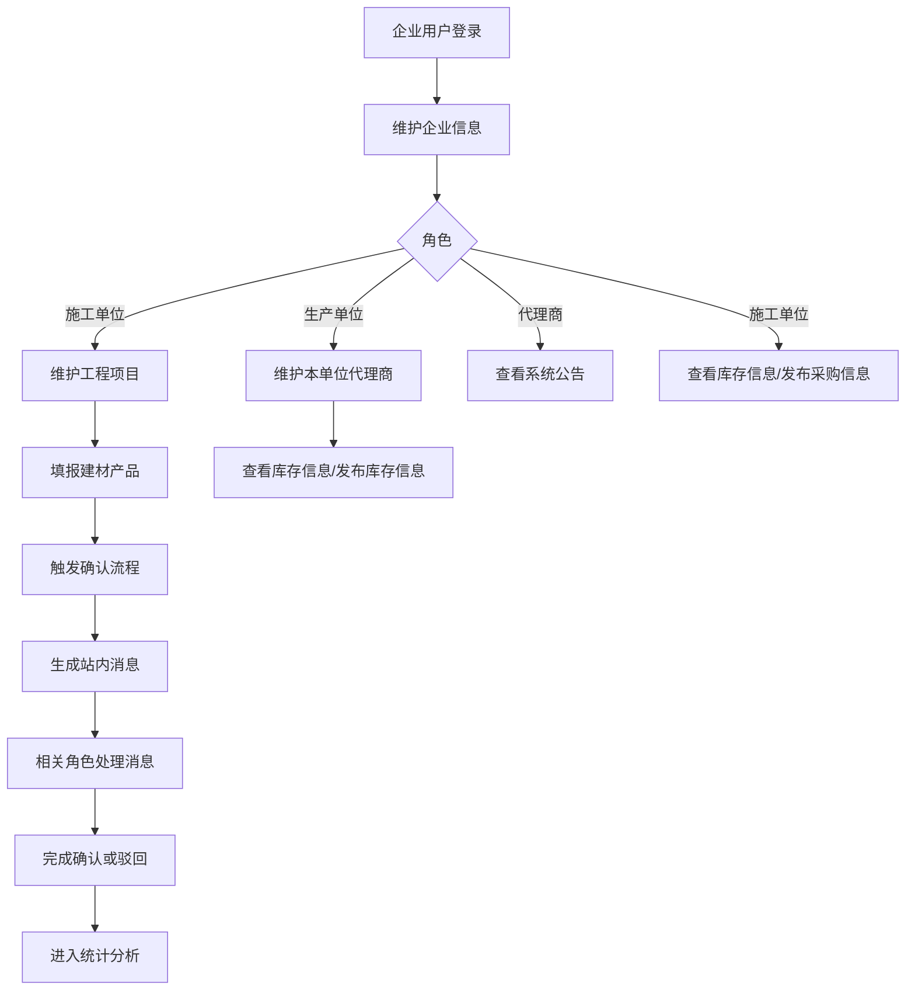
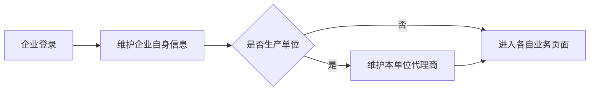
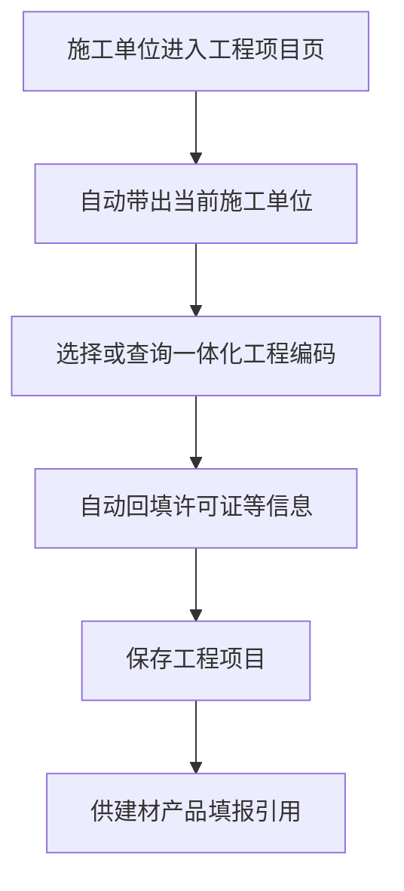
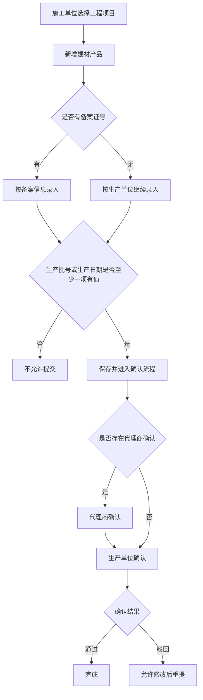
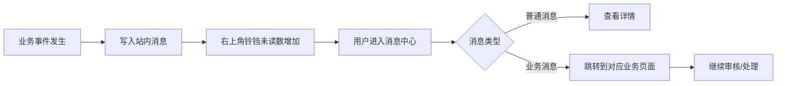
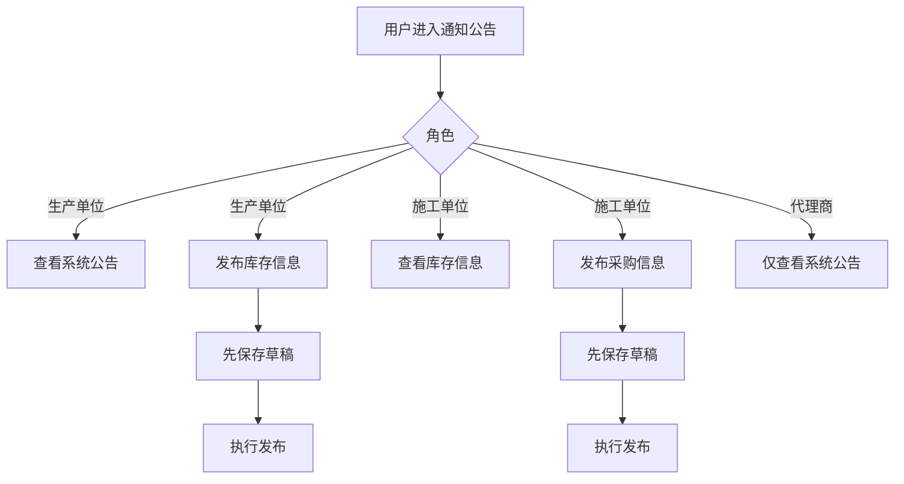

# 青岛市建设工程材料信息管理平台

## 操作手册对照业务流程与差异总览

## 1. 文档目的

本文基于 [青岛市建设工程材料信息管理平台操作手册.docx](/e:/construction-material/openspec/原型/02-来源资料/青岛市建设工程材料信息管理平台操作手册.docx) 与当前代码、提案、问题清单的对照结果整理而成，用于把“操作手册中的标准业务流程”与“当前系统实现状态”串成一份可复核、可整改、可继续拆任务的总览文档。

本文重点回答四个问题：

1. 操作手册里的核心业务流程到底是什么。
2. 当前系统已经实现到了哪一步。
3. 哪些地方属于未实现或实现不正确。
4. 这些问题分别落在哪些 change 和 `issues.md` 里。

## 2. 适用范围

本次串联范围覆盖以下模块：

1. 企业信息
2. 工程项目
3. 建材产品
4. 消息中心
5. 通知公告
6. 统计中心

对应 change：

1. `base-companyinfo`
2. `materials-project`
3. `materials-project-product`
4. `message-center`
5. `notice-announcement`
6. `statistics-center`

## 3. 角色视角

根据操作手册，本系统至少存在以下业务角色视角：

1. 生产单位
2. 施工单位
3. 代理商

当前代码实现中，还混入了较强的“后台主数据维护”视角，这也是很多偏差的根源之一。

### 3.1 手册中的角色边界

| 角色 | 手册侧主要行为 |
| --- | --- |
| 生产单位 | 维护自身信息、维护本单位代理商、填报或确认建材产品、查看系统公告、发布库存信息、查看采购信息 |
| 施工单位 | 维护自身信息、维护工程项目、填报建材产品使用信息、查看系统公告、查看库存信息、发布采购信息、查看统计分析 |
| 代理商 | 参与部分建材确认链路、查看系统公告 |

### 3.2 当前实现的总体偏差

当前系统不少页面实现成了“全量企业主数据维护页面”，而不是“当前登录企业在自身上下文内办理业务”的模式。最典型的表现有：

1. 施工单位可以手工重新选施工企业，而不是自动带出当前登录单位。
2. 代理商维护可以从全量生产企业里选择所属企业，而不是绑定当前生产单位上下文。
3. 若干数据库与历史迁移类能力已经落代码，但文档和原型说明还停留在旧状态。

## 4. 全局业务主链路

从操作手册看，系统的核心主链路可以概括为：

`企业身份进入系统 -> 完善企业信息 -> 施工单位维护工程项目 -> 施工单位填报建材产品 -> 生产单位/代理商参与确认 -> 系统发送消息提醒 -> 用户通过消息或公告继续处理 -> 最终进入统计分析`

可以用下面这张总流程图理解。

## 5. 分模块流程串联

## 5.1 企业信息流程

### 5.1.1 手册标准流程

1. 企业用户登录系统。
2. 维护本企业基础信息。
3. 生产单位如有需要，可维护本单位代理商信息。
4. 后续业务页面默认沿用当前企业上下文。

### 5.1.2 当前实现状态

已实现：

1. 企业信息列表、详情、编辑基础能力已具备。
2. 联系人、联系电话、地区中文名等历史问题已修复。
3. 代理商可关联所属生产企业。

与手册不一致：

1. 当前实现提供了施工企业、生产企业、代理商三类企业的后台主数据维护能力，范围大于手册。
2. 代理商维护允许从全量生产企业中选择所属企业，不是“当前生产单位维护本单位代理商”的模式。

对应问题文件：

1. [base-companyinfo/issues.md](/e:/construction-material/openspec/changes/base-companyinfo/issues.md)

### 5.1.3 流程图

## 5.2 工程项目流程

### 5.2.1 手册标准流程

1. 施工单位进入工程项目页面。
2. 新增工程项目时，施工单位应由当前登录单位自动带出。
3. 用户补充工程名称、施工许可证、一体化工程编码等信息。
4. 保存后用于后续建材产品填报。

### 5.2.2 当前实现状态

已实现：

1. 工程项目主数据已切换到 `master.t_project`。
2. 一体化工程编码下拉选择、自动回填能力已具备。

与手册不一致：

1. 当前页面仍允许手工下拉选择施工单位，而非自动带出当前施工单位。
2. 一体化工程编码查询口径仍与设计要求不完全一致，后端 SQL 过滤条件需要继续统一。

对应问题文件：

1. [materials-project/issues.md](/e:/construction-material/openspec/changes/materials-project/issues.md)

### 5.2.3 流程图

## 5.3 建材产品填报与确认流程

### 5.3.1 手册标准流程

1. 施工单位选择工程项目。
2. 新增建材产品记录。
3. 若有备案证号则按备案信息关联。
4. 若无备案证号，也应允许继续录入，并按生产单位补录。
5. 生产批号、生产日期至少填写一项。
6. 保存后进入确认流程。
7. 根据业务场景，由代理商或生产单位进行确认。
8. 结果可为通过、驳回、再次提交等。
9. 未审核记录应允许编辑、删除。
10. 导出时受 2000 条上限约束。

### 5.3.2 当前实现状态

已实现：

1. 列表查询、联动选择、表单布局、图片上传、状态流转等主干能力已基本落地。
2. 建材产品数据主链路已围绕 `master.t_project_product` 组织。
3. “无备案证号继续录入”“未审核可编辑删除”“生产批号 / 生产日期至少一项必填”“导出上限 2000 条”等前期差异已完成闭环。

与手册不一致：

1. 列表操作栏的“重置信息确认状态”按钮及对应后端逻辑尚未实现。
2. 产品“规格 - 单位”数据模型仍未最终收口。
3. 供应商名称“无”的业务口径仍需继续核对录入、保存、导出全链路。

对应问题文件：

1. [materials-project-product/issues.md](/e:/construction-material/openspec/changes/materials-project-product/issues.md)

### 5.3.3 流程图

## 5.4 消息中心流程

### 5.4.1 手册标准流程

1. 业务流转时系统产生站内消息。
2. 右上角铃铛展示真实未读数。
3. 用户在消息中心查看收件消息、预警消息。
4. 点击业务类消息后，应跳转到对应业务页面继续处理。
5. 手工发送消息与业务消息应汇聚到统一提醒入口。

### 5.4.2 当前实现状态

已实现：

1. 消息中心底层运行模型已切换到 `base_message` / `base_message_receive`。
2. 顶部铃铛已接入真实摘要接口 `/message/notification/summary`。
3. 业务类消息已支持跳转到对应建材产品处理页。
4. 手工发送消息与业务消息已汇聚到统一提醒入口。

与手册不一致：

1. 公告目前没有用户维度已读关系，统一提醒中的公告暂按只读信息展示，不参与未读统计。
2. 历史迁移仍需兼容 `test.t_message` 和少量非纯数字用户标识。
3. 消息模板当前仅完成结构迁移与预留，运行时模板发送能力尚未接入。

对应问题文件：

1. [message-center/issues.md](/e:/construction-material/openspec/changes/message-center/issues.md)

### 5.4.3 流程图

## 5.5 通知公告流程

### 5.5.1 手册标准流程

1. 企业侧“系统公告”是只读查看。
2. 生产单位可发布库存信息，查看采购信息。
3. 施工单位可查看库存信息，发布采购信息。
4. 代理商仅查看系统公告。
5. 库存信息发布、采购信息发布应先保存草稿，再执行发布。
6. 发布时应基于当前登录角色与企业上下文，不需要手工选企业。

### 5.5.2 当前实现状态

已实现：

1. “系统公告”已收口为只读查看页。
2. 库存信息、采购信息已支持“草稿 -> 发布”流转。
3. 前后端都已取消手工选择企业，改为按当前角色与企业上下文控制可见范围。
4. 公告列表与详情已补充发布人展示。

与手册仍有差异或未收口点：

1. `msg_notice_publish` 当前仍沿用运行库表结构：草稿也会落 `publish_time`，若要改成“草稿无发布时间”仍需新的实现变更。
2. 开发库 `msg_publish_status` 字典仍缺少 `draft`。
3. `msg_notice_publish` 的主键/索引定义尚未完整落库。

对应问题文件：

1. [notice-announcement/issues.md](/e:/construction-material/openspec/changes/notice-announcement/issues.md)

### 5.5.3 流程图

## 5.6 统计中心流程

### 5.6.1 手册标准流程

1. 进入“统计分析”页面。
2. 查询前至少选择“产品类别”和“产品名称”。
3. 查看统计结果。

### 5.6.2 当前实现状态

已实现：

1. 统计分析页已要求先选择产品类别和产品名称后再查询。
2. 统计分析页与采购价格分析页的导出能力已接入后端接口。

与手册不一致：

1. 系统额外扩展了“采购价格分析”页面，但该页面并未在操作手册中明确出现，需继续作为增量能力标记。

对应问题文件：

1. [statistics-center/issues.md](/e:/construction-material/openspec/changes/statistics-center/issues.md)

### 5.6.3 流程图

## 6. 各模块差异汇总表

| 模块 | 手册标准 | 当前主要偏差 | 对应问题文件 |
| --- | --- | --- | --- |
| 企业信息 | 企业维护自身信息，生产单位维护本单位代理商 | 当前实现偏后台主数据维护，代理商维护未绑定当前生产单位上下文 | `base-companyinfo/issues.md` |
| 工程项目 | 施工单位自动带出当前单位 | 当前仍可手工选择施工单位 | `materials-project/issues.md` |
| 建材产品 | 支持无备案证号继续录入，未审核可编辑删除，导出上限 2000 | 主链路已基本对齐，剩余是重置状态按钮、规格单位模型、供应商名称口径未收口 | `materials-project-product/issues.md` |
| 消息中心 | 铃铛显示真实未读数，业务消息可跳转业务页 | 主链路已基本对齐，剩余是公告已读模型、历史迁移兼容、模板发送未收口 | `message-center/issues.md` |
| 通知公告 | 系统公告只读，库存/采购先草稿后发布，角色边界清晰 | 业务流程已基本对齐，剩余是表结构、索引和字典落库未收口 | `notice-announcement/issues.md` |
| 统计中心 | 查询前至少选产品类别和产品名称 | 主页面已对齐，剩余是“采购价格分析”属于手册外增量能力 | `statistics-center/issues.md` |

## 7. 建议整改顺序

建议按“先纠正角色上下文，再纠正业务主链路，最后补齐外围功能”的顺序推进。

### 第一优先级

1. 工程项目页“施工单位自动带出”。
2. 建材产品页“重置信息确认状态”与规格单位模型收口。
3. 备案产品 `record_no` 唯一索引落库。
4. 地区模块重复 `en_code` 清理与唯一索引落库。

### 第二优先级

1. 公告已读模型补齐。
2. 历史消息迁移兼容补齐。
3. 通知公告 `draft` 字典、索引和表结构工程化补齐。
4. 用户角色迁移差额与 rollback 记录补齐。

### 第三优先级

1. `batch-import-dialog` 的复用约束、边界测试和错误提示体验。
2. 采购价格分析页面的定位澄清。
3. 企业信息模块是否继续保留后台主数据维护模式。
4. 质量追溯页面与数据口径回写。

## 8. 与现有提案和问题清单的关系

本文件是“总览文档”，不替代各 change 下的正式提案与问题清单。

当前分工建议如下：

1. `proposal.md`
   - 记录该 change 的目标、范围、与手册的差异。
2. `issues.md`
   - 记录可执行的问题项，并标注“对照操作手册发现”。
3. 本文档
   - 负责把所有模块串成一条完整业务链，便于评审、排期和后续分批整改。

## 9. 相关文件

手册原文：

1. [青岛市建设工程材料信息管理平台操作手册.docx](/e:/construction-material/openspec/原型/02-来源资料/青岛市建设工程材料信息管理平台操作手册.docx)

相关问题文件：

1. [message-center/issues.md](/e:/construction-material/openspec/changes/message-center/issues.md)
2. [notice-announcement/issues.md](/e:/construction-material/openspec/changes/notice-announcement/issues.md)
3. [materials-project/issues.md](/e:/construction-material/openspec/changes/materials-project/issues.md)
4. [materials-project-product/issues.md](/e:/construction-material/openspec/changes/materials-project-product/issues.md)
5. [base-companyinfo/issues.md](/e:/construction-material/openspec/changes/base-companyinfo/issues.md)
6. [statistics-center/issues.md](/e:/construction-material/openspec/changes/statistics-center/issues.md)

## 10. 说明

1. 本文中的“手册标准流程”来自操作手册的业务描述整理，不等同于数据库设计说明。
2. 本文中的“当前实现状态”来自本次对前后端代码、提案文档、问题清单的交叉核查。
3. 若后续继续补充质量追溯、材料备案、数据迁移等模块，建议继续沿用本文结构追加章节。
