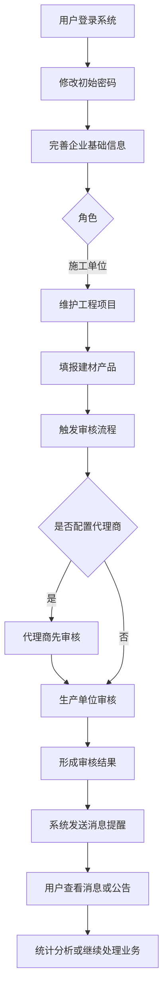
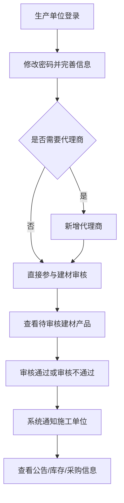
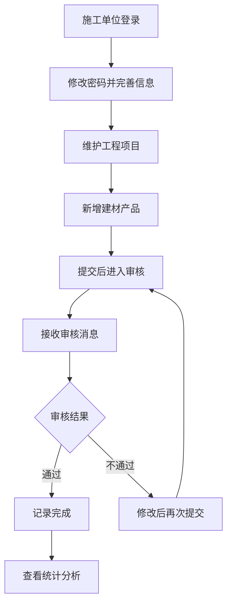
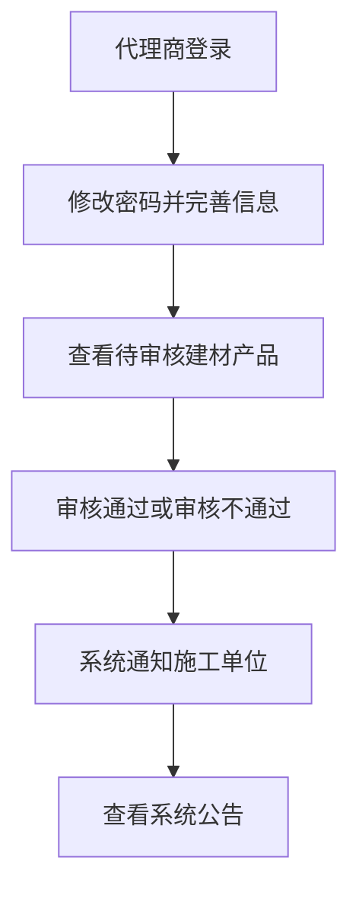
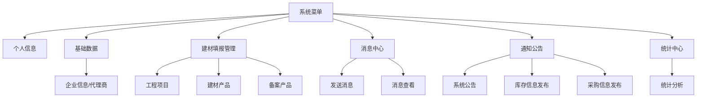

# 青岛市建设工程材料信息管理平台

## 系统操作流程总览（阅读版）

## 1. 文档说明

本文根据现有《青岛市建设工程材料信息管理平台操作手册》整理为一份更适合阅读、培训和快速理解的版本。  
目标不是逐页复刻原手册截图，而是把系统的角色、菜单、操作顺序和关键业务流程串成一套清晰的文字说明。

适合以下场景：

1. 新成员快速了解系统怎么用。
2. 业务人员梳理各角色职责。
3. 产品、开发、测试统一理解系统主流程。
4. 后续编写更正式培训材料的底稿。

## 2. 系统定位

这个平台主要用于围绕“建设工程使用的建材产品”进行信息填报、审核、消息提醒、公告发布和统计分析。

从业务上看，系统围绕三类角色协同工作：

1. 生产单位
2. 施工单位
3. 代理商

其中，施工单位负责填报工程项目和建材产品；生产单位和代理商负责参与审核确认；系统通过消息中心和通知公告进行提醒和信息流转。

## 3. 系统主流程

系统最核心的业务主链路可以概括为：

`登录系统 -> 修改初始密码 -> 完善企业信息 -> 施工单位维护工程项目 -> 施工单位填报建材产品 -> 代理商/生产单位审核 -> 系统发送消息提醒 -> 各角色查看公告或统计结果`

总流程图如下：

## 4. 角色说明

## 4.1 生产单位

生产单位的主要职责：

1. 登录后修改密码并完善本单位信息。
2. 如有需要，创建和维护本单位代理商。
3. 审核施工单位填报的建材产品。
4. 查看备案产品。
5. 使用消息中心发送和接收消息。
6. 查看系统公告。
7. 发布库存信息。
8. 查看施工单位发布的采购信息。

## 4.2 施工单位

施工单位的主要职责：

1. 登录后修改密码并完善本单位信息。
2. 维护工程项目。
3. 填报建材产品信息。
4. 查看备案产品。
5. 使用消息中心发送和接收消息。
6. 查看系统公告。
7. 查看库存信息。
8. 发布采购信息。
9. 进入统计中心做统计分析。

## 4.3 代理商

代理商的主要职责：

1. 登录后修改密码并完善自身信息。
2. 审核属于其业务范围内的建材产品。
3. 查看系统公告。

## 5. 通用使用流程

无论哪个角色，进入系统后的前几步基本一致。

## 5.1 登录

用户使用浏览器访问平台地址，输入账号、密码和验证码后登录。

通用规则：

1. 首次登录通常使用初始密码。
2. 推荐使用极速内核浏览器。
3. 登录成功后进入系统首页。

## 5.2 修改初始密码

首次登录后，建议立即进入右上角个人信息进行密码修改。

密码规则通常包括：

1. 长度 8-16 位。
2. 需要同时包含数字、字母、特殊字符。

## 5.3 完善企业信息

登录后需要完善本单位基础信息，通常包括：

1. 联系人
2. 联系电话
3. 省市区
4. 详细地址

这里的核心目的，是确保后续业务流转、审核沟通和统计信息都能正确关联到企业主体。

## 6. 生产单位操作流程

## 6.1 生产单位总览

生产单位的业务重点有两条：

1. 管理代理商
2. 审核建材产品

流程图如下：

## 6.2 设置代理商审核

如果生产单位有代理商参与业务，可以先在基础数据中维护代理商。

操作逻辑通常是：

1. 进入【基础数据】下的【代理商】。
2. 点击新增。
3. 选择所属生产企业。
4. 录入代理商名称、地址、联系人、联系电话。
5. 为代理商创建登录账号和初始密码。

业务意义：

1. 生产单位配置代理商后，某些建材产品会先由代理商审核，再进入生产单位审核。
2. 如果没有代理商，则由生产单位直接审核。

## 6.3 审核建材产品

生产单位进入【建材填报管理】下的【建材产品】后，可以查看施工单位已提交的建材产品信息。

生产单位主要关注：

1. 待审核记录
2. 已审核记录
3. 审核不通过记录
4. 待再次审核记录

审核动作通常有两种：

1. 审核通过
2. 审核不通过

如果审核不通过，需要填写不通过原因。  
施工单位收到结果后，可以修改并再次提交。  
系统会通过消息提醒通知相关角色。

## 6.4 查看备案产品

生产单位可查看本企业生产的备案产品信息，用于：

1. 核对备案证号
2. 确认备案状态
3. 辅助建材审核

## 6.5 消息中心

生产单位可以：

1. 发送消息给其他用户
2. 查看别人发送给自己的消息
3. 通过右上角铃铛快速查看未读消息或公告

## 6.6 通知公告

生产单位在通知公告模块主要有三类信息：

1. 系统公告
2. 库存信息发布
3. 采购信息发布

其中：

1. 系统公告用于查看平台通知。
2. 库存信息发布用于对外发布产品库存信息。
3. 采购信息发布用于查看施工单位发布的采购需求。

## 7. 施工单位操作流程

## 7.1 施工单位总览

施工单位是系统中最主要的数据填报角色，负责把工程项目和建材产品使用信息录入系统。

流程图如下：

## 7.2 工程项目管理

施工单位先维护工程项目，再进行建材产品填报。

工程项目一般包括这些信息：

1. 施工许可证号
2. 许可发证日期
3. 工程名称
4. 工程类别
5. 建筑面积
6. 工程进度
7. 工程地址
8. 工程结构型式
9. 质量监督机构
10. 施工单位负责人
11. 施工单位负责人联系方式
12. 备注

业务上，工程项目是后续建材产品填报的基础。

## 7.3 建材产品填报

施工单位进入【建材填报管理】下的【建材产品】进行新增、查询、编辑、删除、导出等操作。

填报一条建材产品，一般需要经历以下步骤：

1. 选择工程名称。
2. 系统根据工程自动回填施工许可证和工程进度。
3. 选择产品类别。
4. 选择产品名称。
5. 选择或填写产品规格。
6. 系统自动带出单位。
7. 选择采购主体。
8. 输入备案证号。
9. 系统根据备案证号带出生产单位名称和地址。
10. 填写供应商名称。
11. 填写生产批号或生产日期。
12. 填写采购数量和采购单价。
13. 选择进场时间。
14. 上传合格证、检验报告、照片等附件。
15. 保存并提交。

### 7.3.1 建材产品审核状态的理解

在施工单位视角，常见状态包括：

1. 待审核
2. 已审核
3. 审核不通过
4. 待再次审核
5. 审核再次不通过

如果审核不通过，施工单位可以查看原因，再修改数据重新提交。

### 7.3.2 建材产品导出

施工单位可以把查询后的建材产品列表导出为 Excel，用于：

1. 归档
2. 统计
3. 对外报送
4. 自主做数据分析

## 7.4 查看备案产品

施工单位也可以查看备案产品信息，用于录入建材产品时核对备案证号和产品状态。

## 7.5 消息中心

施工单位可在消息中心：

1. 主动给其他人发送消息
2. 接收审核提醒
3. 接收公告提醒
4. 查看历史消息内容

很多审核流转都依赖消息提醒，所以消息中心是施工单位日常使用频率很高的模块。

## 7.6 通知公告

施工单位在通知公告模块主要做三件事：

1. 查看系统公告
2. 查看生产单位发布的库存信息
3. 发布采购信息

采购信息发布的一般过程是：

1. 新增采购信息
2. 填写标题和内容
3. 保存
4. 确认无误后发布

## 7.7 统计分析

施工单位可以进入【统计中心】下的【统计分析】，根据产品类别、产品名称等条件查询汇总结果。

统计分析的价值主要体现在：

1. 了解某类建材使用情况
2. 按项目或产品维度汇总数据
3. 辅助内部统计和管理

## 8. 代理商操作流程

## 8.1 代理商总览

代理商的核心职责比较聚焦，重点在建材审核。

流程图如下：

## 8.2 代理商信息维护

代理商基础信息通常由生产单位预先创建，但代理商登录后可以进一步核对和完善自己的信息。

## 8.3 审核建材产品

如果某生产单位配置了代理商，则相关建材产品会先流转到代理商审核。

代理商审核时主要做两件事：

1. 审核通过
2. 审核不通过

若不通过，通常需要：

1. 选择不通过原因类别
2. 填写具体不通过原因

之后系统会通知施工单位。  
施工单位修改后再次提交，再进入下一轮审核。

## 8.4 通知公告

代理商主要查看系统公告，并可通过右上角铃铛快速关注最新通知。

## 9. 消息中心使用说明

消息中心是三类角色都会使用的公共模块。

主要分为两部分：

1. 发送消息
2. 消息查看

## 9.1 发送消息

发送消息的一般步骤：

1. 点击【发送消息】
2. 输入标题
3. 选择接收人
4. 确认发送

适用场景：

1. 业务沟通
2. 人工提醒
3. 问题反馈

## 9.2 消息查看

消息查看主要用于：

1. 查看别人发送给自己的消息
2. 查看系统发送的审核提醒
3. 通过消息进入相关业务页面继续处理

## 9.3 铃铛提醒

系统右上角的铃铛是消息和公告的快捷入口。

用户可以通过它快速判断：

1. 是否有未读消息
2. 是否有待处理审核提醒
3. 是否有新公告

## 10. 通知公告使用说明

通知公告模块承担的是“公开给角色群体查看的信息发布”。

通常包括：

1. 系统公告
2. 库存信息发布
3. 采购信息发布

可以理解为：

1. 消息中心偏“点对点提醒”
2. 通知公告偏“面向角色群体的信息发布”

## 10.1 系统公告

系统公告主要由平台管理方发布，供企业用户查看。

## 10.2 库存信息发布

库存信息发布主要面向施工单位，用于让施工单位看到生产企业当前对外可供的产品库存信息。

## 10.3 采购信息发布

采购信息发布主要面向生产单位，用于让生产企业看到施工单位当前的采购需求信息。

## 11. 统计中心使用说明

统计中心主要面向施工单位，用于做建材填报数据的汇总分析。

常见使用方式：

1. 选择产品类别
2. 选择产品名称
3. 补充其他筛选条件
4. 查看查询结果

如果需要更灵活的统计，也可以先把建材产品数据导出到 Excel 再自行分析。

## 12. 菜单与业务关系

从阅读角度，可以把系统菜单理解为下面几个层次：

## 13. 日常使用建议

为了让系统使用更顺畅，日常使用可以遵循以下顺序：

1. 首次登录先修改密码。
2. 先补全企业基础信息，再进入业务页面。
3. 施工单位先建工程项目，再填建材产品。
4. 经常关注右上角铃铛，及时处理审核提醒。
5. 审核不通过时，优先看清原因后再修改。
6. 需要统计时，优先用系统查询；复杂分析可导出 Excel。

## 14. 常见业务理解

### 14.1 为什么要先录工程项目

因为建材产品属于具体工程项目下的数据，没有项目就无法准确关联建材使用场景。

### 14.2 为什么会有代理商审核

有些生产单位的销售和供货信息由代理商掌握，代理商更清楚采购数量和供应关系，所以在部分场景下会先由代理商审核，再由生产单位审核。

### 14.3 消息中心和通知公告有什么区别

1. 消息中心更偏个人提醒、点对点沟通、审核流转。
2. 通知公告更偏面向一类用户群体的信息发布。

### 14.4 为什么还要导出 Excel

因为系统内统计功能适合常规汇总，而更复杂、更个性化的分析往往仍然依赖 Excel 二次处理。

## 15. 相关文件

原始手册：

1. [青岛市建设工程材料信息管理平台操作手册.docx](/e:/construction-material/openspec/原型/原型文件/青岛市建设工程材料信息管理平台操作手册.docx)

手册差异总览：

1. [操作手册对照-业务流程与差异总览.md](/e:/construction-material/openspec/原型/原型文件/操作手册对照-业务流程与差异总览.md)

## 16. 说明

1. 本文是“阅读版系统操作总览”，强调的是理解业务流程，不替代原始截图手册。
2. 如果后续需要，还可以在本文基础上继续整理出“角色培训版”“新手 10 分钟上手版”或“测试用例版”。
